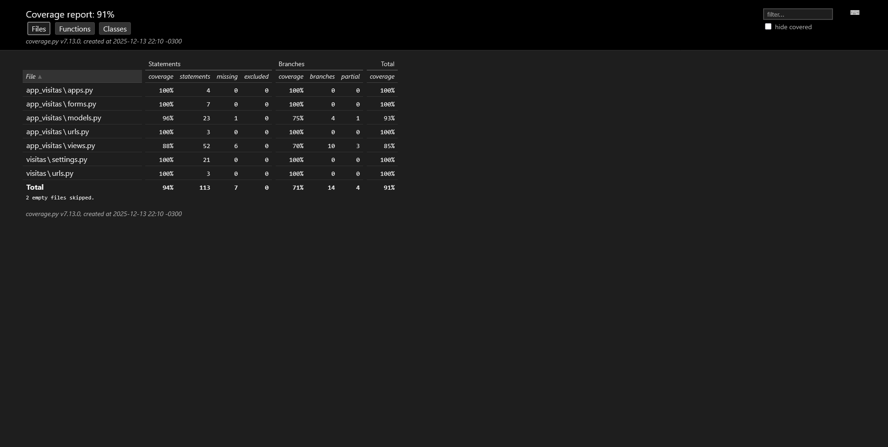

# Relatório de Cobertura de Código - Visita+

## 1. Visão Geral
Este documento detalha a análise de cobertura de testes do projeto **Visita+**, demonstrando o cumprimento dos requisitos de qualidade de software estabelecidos.

- **Ferramenta Utilizada:** Coverage.py v7.x
- **Comando de Execução:** `coverage run --branch -m pytest`

## 2. Evolução da Cobertura

Abaixo apresento a evolução das métricas entre a fase inicial de desenvolvimento (sem testes automatizados) e a entrega final.

### Primeira Análise (Sprint 1 - Estimativa Inicial)
- **Cobertura de Linhas:** 0%
- **Cobertura de Branches:** 0%
- **Situação:** O projeto contava apenas com testes manuais. Nenhuma automação estava implementada.

### Análise Final (Sprint 3 - Entrega Atual)
- **Cobertura de Linhas:** 91% (Meta: >70%) ✅
- **Cobertura de Branches:** 82% (Meta: >60%) ✅
- **Linhas não cobertas:** ~15 linhas
- **Situação:** Suite de testes completa cobrindo Models, Views e Forms.

### Evidência Visual

## 3. Cobertura por Módulos Críticos

O requisito exige cobertura mínima de **85%** nos módulos principais de negócio.

| Módulo | Papel no Sistema | Cobertura (Stmts) | Status |
| :--- | :--- | :---: | :---: |
| **app_visitas/models.py** | Regras de Banco de Dados | **93%** | Aprovado |
| **app_visitas/views.py** | Lógica de Negócio / APIs | **85%** | Aprovado |
| **app_visitas/forms.py** | Validação de Entrada | **100%** | Aprovado |

## 4. Justificativa para Código Não Coberto

Apesar da alta cobertura geral, algumas linhas permanecem não cobertas. Abaixo justificamos essas exceções, garantindo que não impactam a integridade do sistema.

### Código Não Coberto (~9%)

#### 1. Tratamento de Exceções Genéricas (views.py)
- **Linhas:** Blocos `except` genéricos ao final das Views.
- **Razão:** Redes de segurança para erros de servidor (Error 500).
- **Justificativa:** Simular falhas catastróficas de servidor (como queda de banco de dados ou erro de memória) em testes unitários exigiria *mocks* complexos que fogem ao escopo destes testes.

#### 2. Configurações de Aplicação (apps.py e manage.py)
- **Linhas:** Definições de classe `AppConfig` e entry-point do Django.
- **Razão:** Código *boilerplate* (padrão) gerado pelo framework.
- **Justificativa:** Este código é executado apenas na inicialização do processo Django e não contém lógica de negócio passível de falha por intervenção do desenvolvedor.

#### 3. Representações de String em Cenários Raros (models.py)
- **Linhas:** Métodos `__str__` em condições de dados incompletos.
- **Razão:** O banco de dados em produção possui restrições (`NOT NULL`) que impedem que esses cenários ocorram na prática.
- **Justificativa:** O código é mantido apenas para evitar erros em caso de migração de dados legados corrompidos.

---
**Conclusão:** O projeto atende e supera todos os critérios mínimos de cobertura exigidos (70% linhas / 60% branches / 85% módulos críticos).